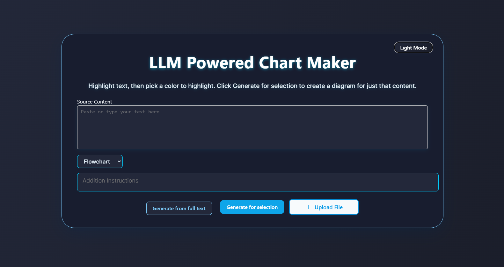
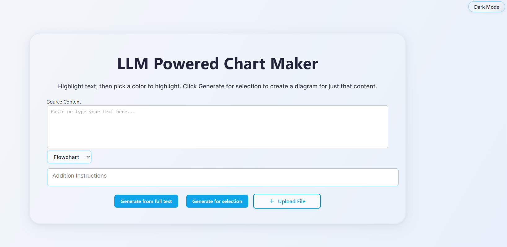
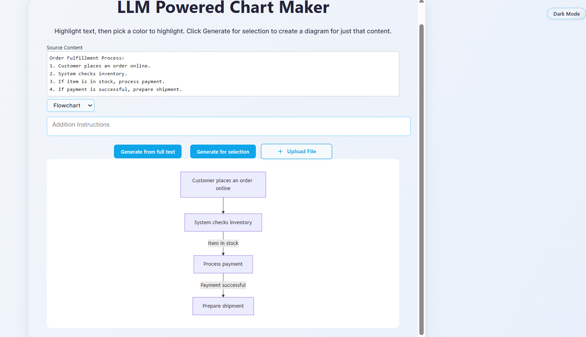
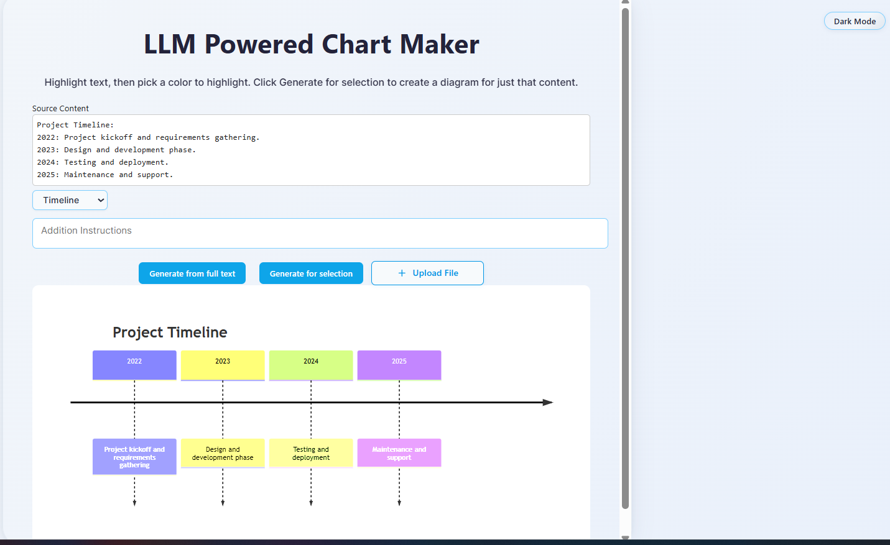
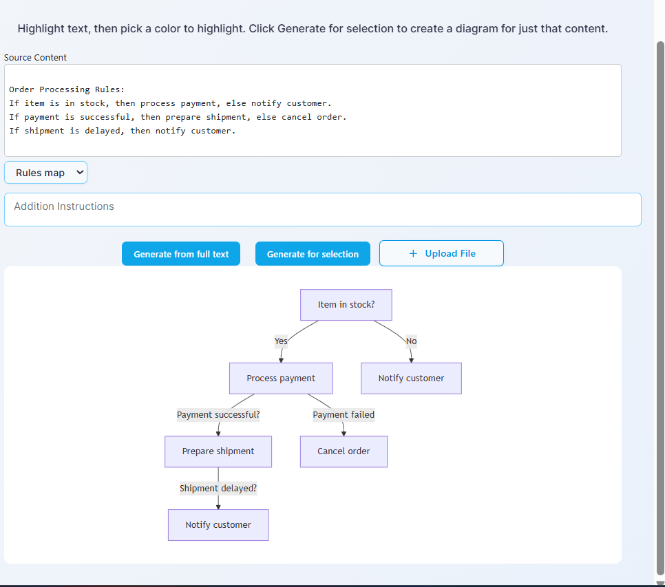
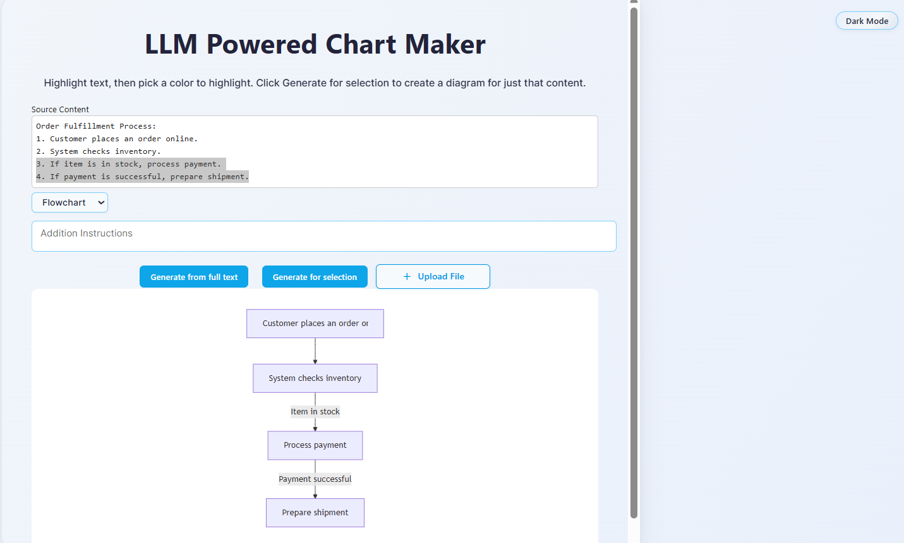
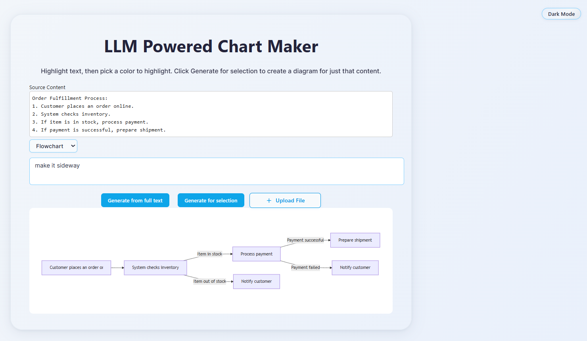
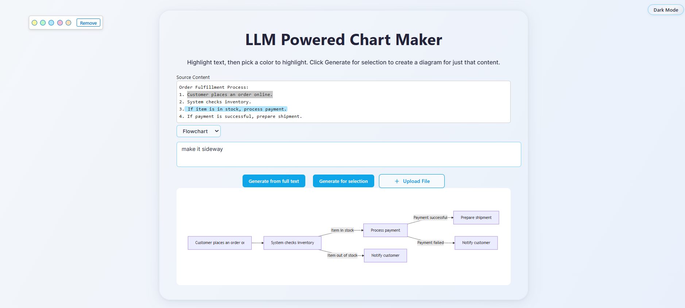

# LLM - Powered Chart Maker

## Quick Setup

### Backend (Node.js + TypeScript)

1. In the `backend` folder:

```pwsh
  cd backend
  npm install
  npm run dev
```

- Set `OPENAI_API_KEY` in a `.env` file for LLM integration.
- If no key is set, the backend uses a deterministic parser for diagrams.

1. For production:

```pwsh
  npx tsc
  node dist/index.js
```

### Frontend (React + Vite + TypeScript)

1. In the `frontend` folder:

```pwsh
  cd frontend
  npm install
  npm run dev
```

- Open the URL printed by Vite (usually [http://localhost:5173](http://localhost:5173)).

1. For production:

```pwsh
  npm run build
```

---

## Approach & Architecture

**Approach:**

- The **frontend** (React + Vite + TypeScript) lets users enter or upload text, highlight any selection (including multi-line), and choose a diagram type (flowchart, timeline, rules map). The UI is modern, responsive, and user-friendly. When a diagram is requested, the frontend sends the text, diagram type, and any instructions to the backend.
- The **backend** (Node.js + Express + TypeScript) receives the request and builds a prompt for the LLM (OpenAI API). If the LLM is unavailable, fails, or returns an empty result, a deterministic fallback parser generates a valid Mermaid diagram from the text, ensuring a diagram is always returned.
- **Diagrams** are rendered client-side using Mermaid.js for instant, interactive visualization.
- The system is robust: it always returns a diagram (even if the LLM fails) and supports flexible user input through multi-line highlighting and selection.

---

## Overview

Test_LLM is a full-stack app that turns text into clear, structured charts (flowcharts, timelines, or rules maps) using LLMs (like OpenAI). Users can highlight content, prompt the LLM, and instantly generate visual diagrams to make complex material easier to understand.

## Features

- Paste/type text or upload files (txt and pdf)
- Highlight text in the editor to generate diagrams for a selection
- Multi-line highlighting: select and color text across multiple lines/blocks
- Choose chart type: flowchart, timeline, or rules
- Instantly generate diagrams using an LLM (or fallback to local parser)
- Renders diagrams using Mermaid.js
- Backend API supports OpenAI-compatible LLMs (with fallback for demo/testing)
- Modular, extensible codebase (React + Vite + TypeScript frontend, Node.js + Express + TypeScript backend)
- **Modern UI/UX:**
  - Redesigned layout and card UI with clear sections, subtle shadows, and rounded corners
  - Upgraded typography and color scheme for accessibility and professional look
  - Polished buttons and controls with modern colors, hover/focus effects, and rounded corners
  - Enhanced responsiveness and spacing for all screen sizes
  - Subtle animations and feedback for color pickers, button presses, and diagram rendering
- **PDF highlight workflow:** When you upload a PDF and click any extracted highlight, its text is sent directly to the main document/text area for chart generation. The PDFViewer's own textarea is not affected.

---

## Screenshots

**Dark theme, main editor**



**Light theme, main editor**



**Flowchart (vertical)**



**Timeline Chart**



**Rules map** 



**Selection and highlight UI & Chart Rendered**



**Sideways/landscape flowchart layout**



**Color picker and highlight toolbar**



## Getting Started

## Usage

1. Enter or paste text, or upload a file (txt, doc, pdf)
2. (Optional) Highlight a portion of the text to generate a diagram for just that selection
3. If you upload a PDF, extracted highlights will appear above the main text area. **Click any highlight to send its text to the main document/text area for chart generation.**
4. Select the diagram type (flowchart, timeline, rules)
5. Click "Generate" to send the request to the backend
6. The diagram is rendered instantly using Mermaid.js


## Architecture

- **Frontend**: React (Vite, TypeScript)
  - `App.tsx`: Main UI, handles text input, selection, diagram type, and API calls
  - `DiagramCanvas.tsx`: Renders Mermaid diagrams
  - `FileUpload.tsx`, `PDFViewer.tsx`: File handling and PDF preview
- **Backend**: Node.js (Express, TypeScript)
  - `/api/diagram`: Accepts text, diagram type, and optional instruction; builds LLM prompt and returns Mermaid code
  - Uses OpenAI API if key is set, otherwise generates diagrams from your text using a local parser
  - Fallback parser for offline/demo use
---

Author: Toan Tran
